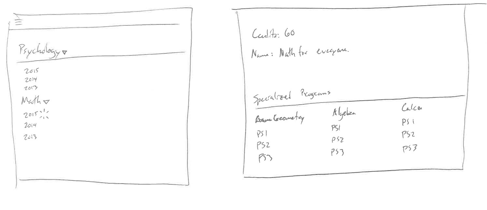
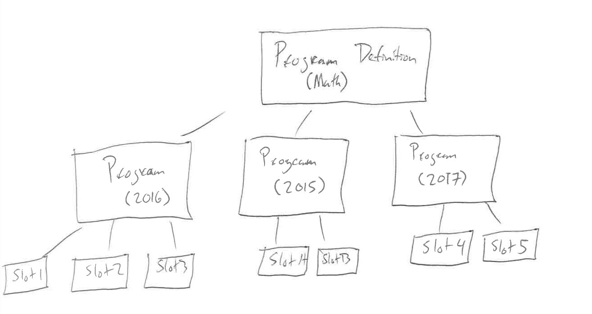
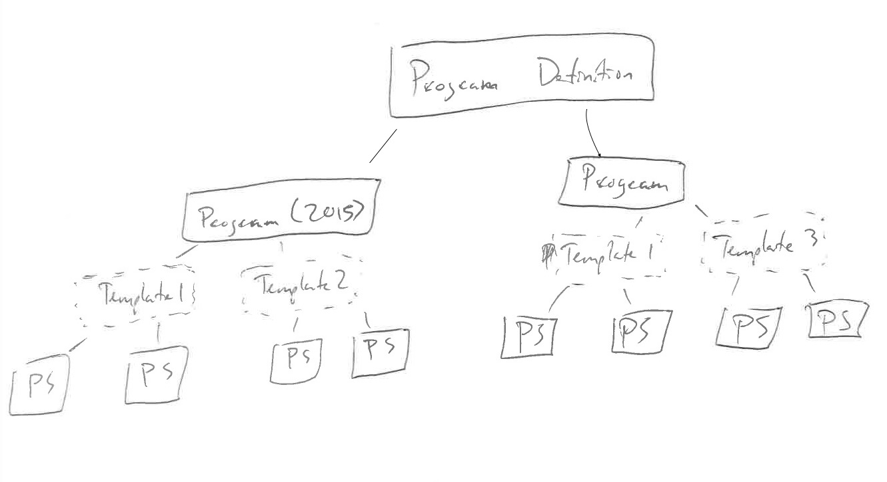
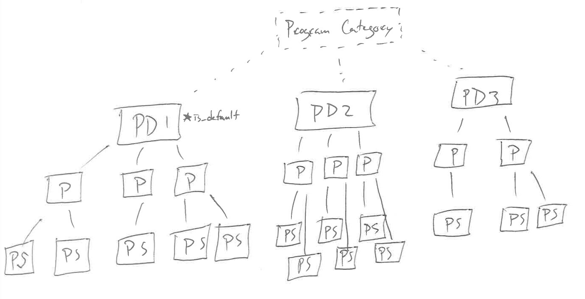
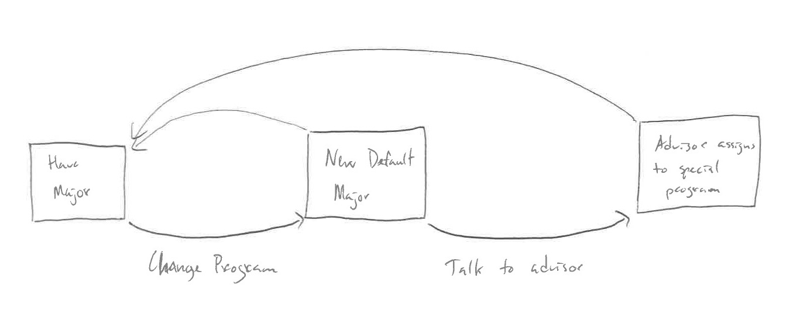

# Multiplan Creation and Use

---

#### Wants

* Allow default and specialized programs for students that are associated (Math vs Math for Astronauts)
* Assignments are managed automatically or outside EAB (scalability)

---

#### Sample flow

(This is why I am a server dev.)

---

#### How the data structures work right now

---

#### Option 1: assign multiple templates to a program

---

#### Upsides

* Intuitive to traverse the relationships as you drill down in the content admin
* Matches how we think of "specializations within a program"

#### Challenges

* Credits are currently marked at the ProgramDefinition level.  Different slot sets could have different credits.
* Migration of code.  How much of our existing codebase codifies the table hierarchy as-is?

---

#### Inferences

* Our current construction of a ProgramDefinition is the natural container for "a thing with program slots"

---

#### Option 2: assign programs to a category

---

#### Upsides

* Adds new structure rather than changing existing structure

#### Challenges

* Less intuitive.  In order to say "things that are like this", you need to go thing -> category -> things in category

---

#### Managing assignment

If we have multiple programs, we would need a scheduled job or on-import task to figure out how to assign a student to a program.  If they change their program in the SIS somehow, we need the rules to assign the student to a program that makes sense.

But such a program is not guaranteed to exist.

---

#### Managing Assignment Proposal

Akin to CourseElements, each program be assigned a logical formula that, if True, matches the student to that program.  If nothing matches, they go into the `is_default` program.

---

#### Cases to consider

 * What happens when a Program gets deleted?
 * Will these specialized Programs just get stale?  Who is responsible for keeping them current?
 * Will we need a "is_locked" parameter on the student-program binding?  What happens if the student places into Math, chooses to join Math for Astronauts, and then her data changes s.t. the formulas would put her in Math for Geniuses?

---

#### More cases to consider

 * How does feedback work for when schools need to make new special programs?  (Ex Math has the "You are in-state" program, but Soc/Anth doesn't.)
 * Transfer students?

---
#### Sample update flow

Updates should be managed by advisors, not EAB employees.

---

#### Next steps and considerations

 * Tweaking the core program models involves getting Phil's buy-in
 * Case brainstorming.  What difficult user flows can we imagine?

---

